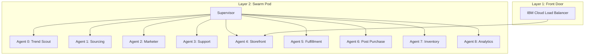

# 9-State Regional Retail Swarm Engine

## Overview
This standardized deployment package implements a 9-state regional retail swarm architecture. It leverages a multi-agent system where each agent is responsible for a specific stage of the e-commerce lifecycle, from trend scouting to post-purchase analytics.

The system is designed for high availability and regional isolation, managed by a central Supervisor daemon that ensures process stability and automatic recovery.

## System Architecture



## watsonx Orchestrate Integration
This swarm is fully compatible with **IBM watsonx Orchestrate**. Each agent's specialized capability is exposed as a "Skill" via the Storefront API.

### Available Skills:
- **Scout Trends**: Analyzes regional data for market opportunities.
- **Check Inventory**: Real-time stock status across 9 states.
- **Process Order**: Triggers the fulfillment and delivery pipeline.

### How to Import Skills:
1. Download the `swarm_skills.json` file from this repository.
2. In watsonx Orchestrate, go to **Skills and Apps** > **Add Skills** > **From files**.
3. Upload `swarm_skills.json`.
4. Connect the app using your API credentials.

## Environment Variables
The system is configured via `idm/system/env.sh`. The following variables are required:

| Variable | Description | Example |
|----------|-------------|---------|
| `SWARM_ENV` | Deployment environment | `production` |
| `LOG_DIR` | Directory for system and agent logs | `/idm/system/logs` |
| `GEMINI_MODEL` | AI model used for agent decision logic | `gemini-1.5-pro` |
| `REGION_COUNT` | Number of states/regions in the swarm | `9` |

## Directory Structure
- `idm/agents/`: Individual agent logic and bootstrap scripts.
- `idm/system/`: Core configuration files (environment, supervisor, crontabs).
- `idm/system/logs/`: Centralized log storage.

## Deployment Instructions
1. **Build the Image**:
   ```bash
   docker build -t retail-swarm .
   ```
2. **Run the Swarm**:
   ```bash
   docker run -d --name retail-swarm -p 8080:8080 retail-swarm
   ```
3. **Monitor Logs**:
   ```bash
   docker logs -f retail-swarm
   ```
